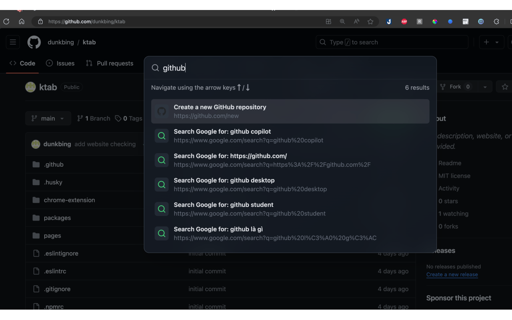

# KTab: Command Palette Chrome Extension



KTab is a simple Chrome extension that adds a customizable command palette to your browser, enhancing your browsing experience with quick access to various actions, searches, and navigation tools.

## Features

- **Quick Access**: Open the command palette with a keyboard shortcut (default: Cmd+Shift+K / Ctrl+Shift+K).
- **Universal Search**: Search across multiple sources:
  - Open tabs
  - Browsing history
  - Bookmarks
  - Google search suggestions
  - Quick actions
- **Tab Management**: Quickly switch between open tabs or restore recently closed tabs.
- **Bookmark Navigation**: Easily access and open your bookmarks.
- **History Lookup**: Search through your browsing history.
- **Quick Actions**: Perform common tasks like creating new documents or opening specific websites.
- **Google Search Integration**: Get Google search suggestions directly in the palette.
- **Keyboard Navigation**: Use arrow keys to navigate through suggestions and Enter to select.

## Installation

1. Clone this repository or download the source code.
2. Open Chrome and navigate to `chrome://extensions`.
3. Enable "Developer mode" in the top right corner.
4. Click "Load unpacked" and select the directory containing the extension files.

## Usage

1. Press Cmd+Shift+K (Mac) or Ctrl+Shift+K (Windows/Linux) to open the command palette.
2. Start typing to search across tabs, history, bookmarks, and actions.
3. Use arrow keys to navigate through suggestions.
4. Press Enter to select an item or perform an action.

### Special Commands

- `/tab`: Search only through open tabs
- `/history`: Search only through browsing history
- `/bookmark`: Search only through bookmarks

## Customization

You can customize the quick actions by modifying the `actions` array in `constants.ts`. Each action should have the following structure:

```typescript
{
  content: string;  // URL or action identifier
  description: string;  // Display text in the palette
  type: 'action';
  iconUrl: string;  // Path to the icon file
}
```

## Development

This extension is built using React and TypeScript. To set up the development environment:

1. Install dependencies: `pnpm install`
2. Build the extension: `pnpm run build`
3. For development with hot-reloading: `pnpm dev`

## Contributing

Contributions are welcome! Please feel free to submit a Pull Request.

## License

[MIT License](LICENSE)

## Acknowledgements

- Icons provided by [Lucide](https://lucide.dev/)
- This project uses [Chrome Extension Boilerplate with React + Vite + TypeScript](https://github.com/Jonghakseo/chrome-extension-boilerplate-react-vite)
